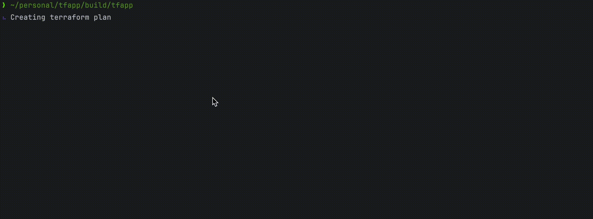

# tfapp - Enhanced Terraform Experience

[](https://go.dev/)
[](LICENSE)
[](https://github.com/yourusername/tfapp/releases)

A delightful, feature-rich interface for Terraform that makes infrastructure management more intuitive and efficient.



## ✨ Key Features

- 🚀 **Interactive Interface** - Navigate infrastructure workflows with intuitive menus
- 🎯 **Resource Targeting** - Select specific resources for targeted applies
- 🌈 **Colorized Output** - Clear, color-coded information for better readability
- ⚙️ **Customizable UI** - Personalize colors and UI elements to match your preferences

## 🚀 Quick Start

### System Requirements

- **Go**: Version 1.24 or later
- **Terraform**: CLI installed and available in PATH
- **Operating Systems**: Compatible with Linux, macOS, and Windows

### Installation Methods

#### Install from Binary

```bash
# Download the latest release
curl -LO https://github.com/yourusername/tfapp/releases/latest/download/tfapp_$(uname -s)_$(uname -m).tar.gz

# Extract the binary
tar -xzf tfapp_$(uname -s)_$(uname -m).tar.gz

# Move to a location in your PATH
sudo mv tfapp /usr/local/bin/

# Verify installation
tfapp --version
```

#### Using Homebrew

```bash
# Install via Homebrew (macOS and Linux)
brew tap sapasapasapa/tap
brew install tfapp

# Or in a single command
brew install sapasapasapa/tap/tfapp
```

### Using TFApp

```bash
# Check installation
tfapp -h

# Use it in your Terraform project
cd /path/to/terraform/project
tfapp
```

For detailed or alternative installation instructions and troubleshooting, see our [Installation Guide](docs/installation.md).

## 📚 Documentation

For detailed information, check our documentation:

- [Installation Guide](docs/installation.md) - Detailed installation instructions
- [Usage Guide](docs/usage.md) - How to use TFApp effectively
- [Configuration](docs/configuration.md) - Customizing TFApp to your preferences
- [Advanced Features](docs/advanced.md) - Power user features and techniques
- [Development](docs/development.md) - Contributing to TFApp

## 🖼️ Screenshots

<table>
  <tr>
    <td width="50%">
      
      <p align="center"><em>Interactive Menu</em></p>
    </td>
    <td width="50%">
      
      <p align="center"><em>Resource Selection</em></p>
    </td>
  </tr>
  <tr>
    <td width="50%">
      
      <p align="center"><em>Colorized Output</em></p>
    </td>
    <td width="50%">
      
      <p align="center"><em>Plan Overview</em></p>
    </td>
  </tr>
</table>

## 🔄 Version Compatibility

- Terraform: 0.12.x and above
- Go: 1.24 and above
- Platforms: Linux, macOS, Windows

## 👥 Contributing

Contributions are welcome! Check out our [Development Guide](docs/development.md) to get started.

## 📜 License

This project is licensed under the MIT License - see the LICENSE file for details.

## 🙏 Acknowledgments

- Built with [Go](https://go.dev/)
- UI components powered by [Charm](https://charm.sh/) libraries
- Inspired by the Terraform community