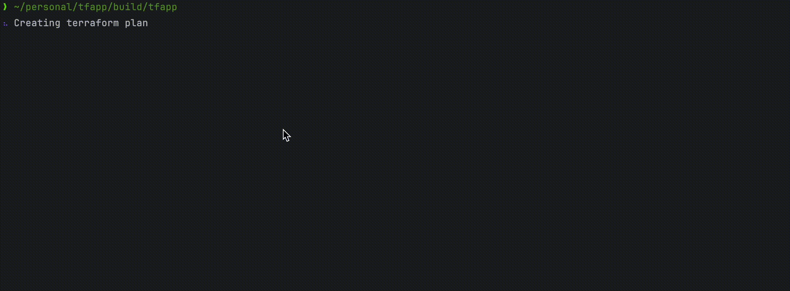

# tfapp - Enhanced Terraform Experience

[](https://go.dev/)
[](LICENSE)
[](https://github.com/yourusername/tfapp/releases)

A delightful, feature-rich interface for Terraform that makes infrastructure management more intuitive and efficient.



## ✨ Key Features

- 🚀 **Interactive Interface** - Navigate infrastructure workflows with intuitive menus
- 🎯 **Resource Targeting** - Select specific resources for targeted applies
- 🔍 **Collapsible Plan View** - Toggle resource blocks and nested sections for better readability
- 🔬 **Full-text Search** - Search within plan output to quickly find specific resources or changes
- 🌈 **Colorized Output** - Clear, color-coded information for better readability
- ⚙️ **Customizable UI** - Personalize colors and UI elements to match your preferences

## 🚀 Quick Start

### System Requirements

- **Go**: Version 1.24 or later
- **Terraform**: CLI installed and available in PATH
- **Operating Systems**: Compatible with Linux, macOS, and Windows

### Installation Methods

#### Using Homebrew (Recommended)

```bash
# Install via Homebrew (macOS and Linux)
brew tap sapasapasapa/homebrew-tap
brew install tfapp

# Or in a single command
brew install sapasapasapa/homebrew-tap/tfapp
```

#### Install from Binary

```bash
# Download the latest release
curl -LO https://github.com/yourusername/tfapp/releases/latest/download/tfapp_$(uname -s)_$(uname -m).tar.gz

# Extract the binary
tar -xzf tfapp_$(uname -s)_$(uname -m).tar.gz

# Move to a location in your PATH
sudo mv tfapp /usr/local/bin/

# Verify installation
tfapp --version
```

#### Build from Source

Building from source gives you the latest code and the ability to customize the build.

1. Clone the repository:
   ```bash
   git clone https://github.com/yourusername/tfapp.git
   cd tfapp
   ```

2. Build the application:
   ```bash
   go build -o build/tfapp ./cmd/tfapp
   ```

3. (Optional) Run tests:
   ```bash
   go test ./...
   ````

4. (Optional) Install the binary to a location in your PATH:
   ```bash
   sudo cp build/tfapp /usr/local/bin/
   ```

5. Verify the installation:
   ```bash
   tfapp --version
   ```

### Using TFApp

```bash
# Check installation
tfapp -h

# Use it in your Terraform project
cd /path/to/terraform/project
tfapp
```
For detailed or alternative installation instructions and troubleshooting, see our [Installation Guide](docs/installation.md).

## 📚 Documentation

For detailed information, check our documentation:

- [Installation Guide](docs/installation.md) - Detailed installation instructions
- [Usage Guide](docs/usage.md) - How to use TFApp effectively
- [Configuration](docs/configuration.md) - Customizing TFApp to your preferences
- [Advanced Features](docs/advanced.md) - Power user features and techniques
- [Development](docs/development.md) - Contributing to TFApp

## 📚 Features Explained

### Interactive Menu Navigation

Navigate through the application using intuitive keyboard shortcuts:
- Up/Down arrows to move between options
- Enter to select an option
- Q to quit

### Collapsible Plan View

When viewing Terraform plans, you can now easily toggle resource blocks and nested sections:
- Space/Left/Right to expand/collapse sections
- 'a' key to expand all sections at once
- 'A' key to collapse all sections at once
- 'j'/'k'/Up/Down to navigate through resources
- 'g' or Home key to jump to the top
- 'G' or End key to jump to the bottom
- '/' to enter search mode and search within the plan
- 'n' to find the next search match
- 'N' to find the previous search match
- 'Esc' to exit search mode
- '?' to toggle help text
- 'q' to quit the plan view and return to the menu

This makes complex plans much easier to read and understand, especially when dealing with many changes.

## 🔄 Version Compatibility

- Terraform: 0.12.x and above
- Go: 1.24 and above
- Platforms: Linux, macOS, Windows

## 👥 Contributing

Contributions are welcome! Check out our [Development Guide](docs/development.md) to get started.

## 📜 License

This project is licensed under the MIT License - see the LICENSE file for details.

## 🙏 Acknowledgments

- Built with [Go](https://go.dev/)
- UI components powered by [Charm](https://charm.sh/) libraries
- Inspired by the Terraform community
